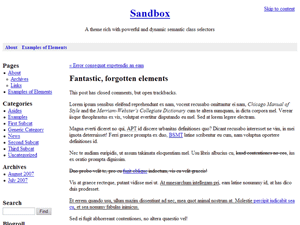

# SandBox

> One of the most influential blog themes, the Sandbox is a starting point for designers and developers—the original and best blank slate theme. The Sandbox is rich with semantic classes powered by dynamic functions and Microformats. A collaboration between Scott (that’s me) and [Andy](http://www.plaintxt.org/out?u=http://andy.wordpress.com/).

This repo is not only to storage this theme, but also, I'll try fix it in order to be compatible with the latest WordPress.

Origin version you could find at <http://www.plaintxt.org/>

## Screenshots



## License

```license
                    GNU GENERAL PUBLIC LICENSE
                       Version 3, 29 June 2007

 Copyright (C) 2007 Free Software Foundation, Inc. <https://fsf.org/>
 Everyone is permitted to copy and distribute verbatim copies
 of this license document, but changing it is not allowed.
 ```
